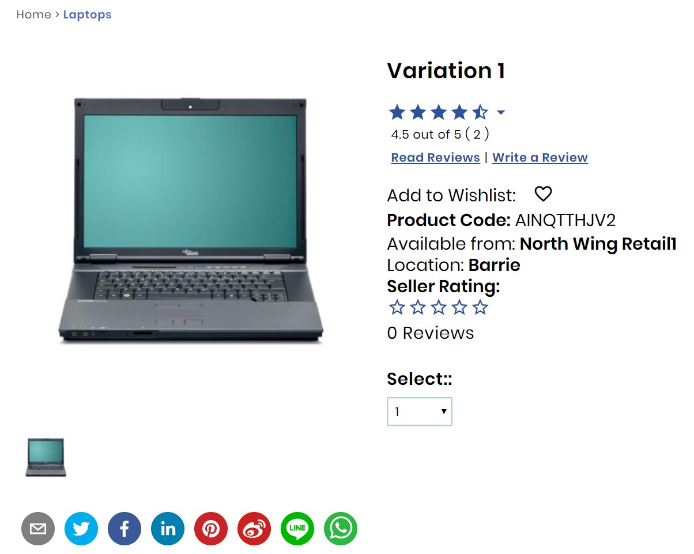
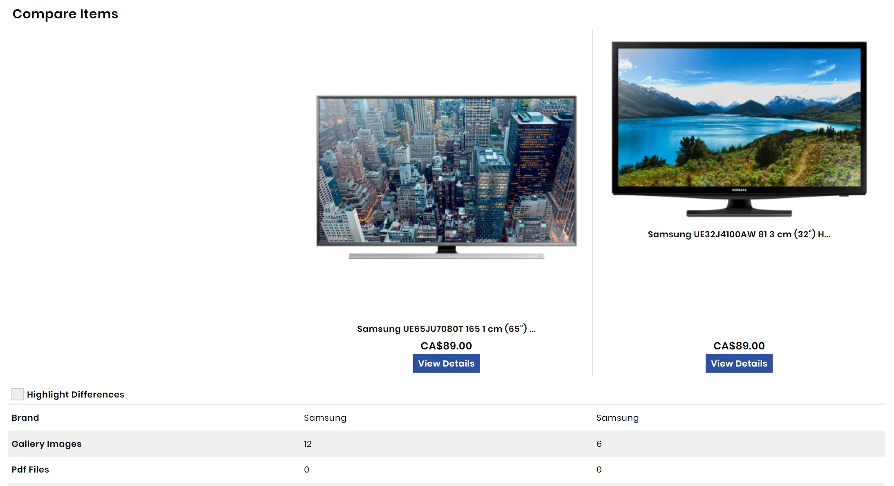
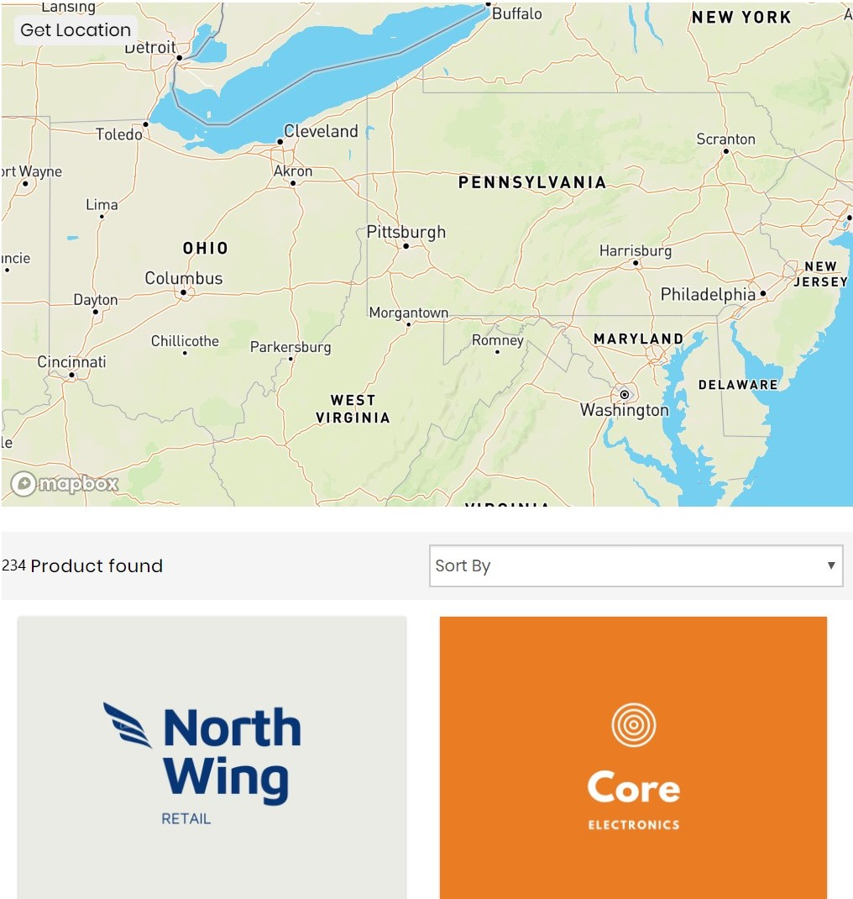

In this project, I was a part of the team which created a blueprint of high-end e-commerce stores. The website is fully functional and ready for any business that desires to have a fast, elegant and secure marketplace and aims to meet the best product with the most suitable customer.

<!-- end -->

The project includes important features that are critical to keep the users on the page and allow them to be comfortable navigating on the website.

## E-commerce Functionality

- Comparing products' features.
- Commenting and giving stars on products.
- Sharing the products with your loved ones.
- Adding products to the wish list.
  

## B2B Features

- Managing products with the ease of content management systems.
- Scalability.
- Adjusting the main page and suggested products by the geographic location using google maps API.
- Having different language options.

#### The location-based map shows retail around the user. Users can visit retail stores and can check stores' products or retails' contact information etc.
