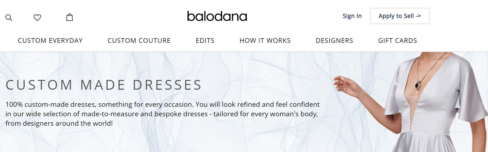
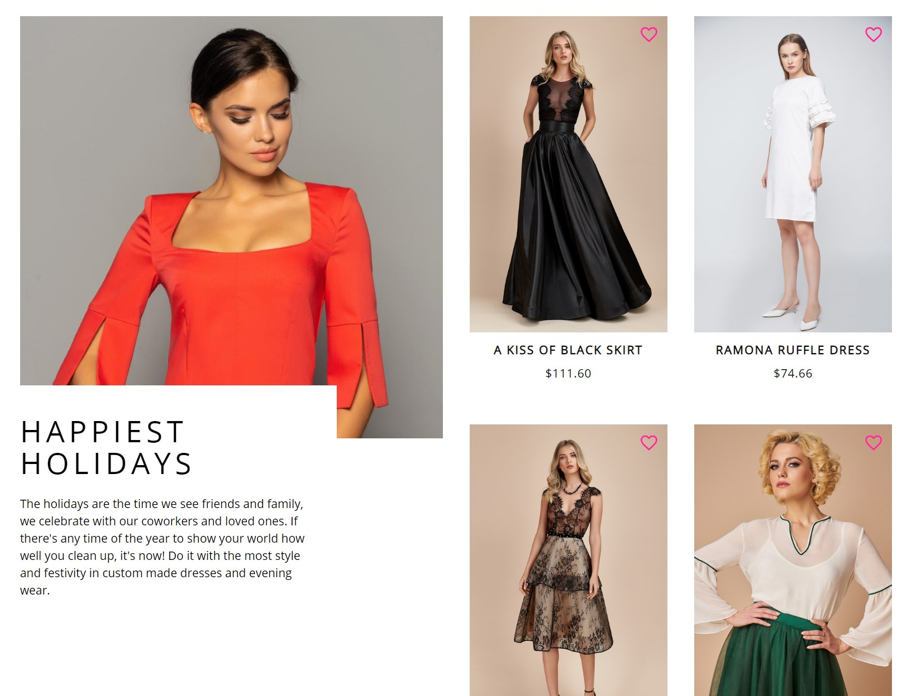

In this project I was a part of team which created a blueprint of high-end ecommerce stores. Website is fully functional and ready for any business that desires to have a fast, elegant and secure marketplace and aims to meet the best product with the most suitable customer.

<!-- end -->

The project includes important features which is cruical to keep the users in the page and allow them to be comfortable navigating in the website.

<!-- - **Functionality** (_for business owners_) -->

## Crucial B2B Feature

- Managing products with the ease of content management systems.
- Scalability
- Adjusting the main page and suggested products by the geographic location using google maps api.
- Having different language options that again would enable you to access a wider audience.

#### Location based map shows retails around the user. User can visit retail stores and can check stores' products or retails' contact information etc.

<!--
  - Parallel design to the leading ecommerce solutions.
  - Mobile-first design
  - Fully responsible -->

## All E-commerce Functionality

- Comparing products with a click of a button.
- Commenting and giving stars on products.
- Sharing the products with your loved ones.
- Adding products to wish list.
  
