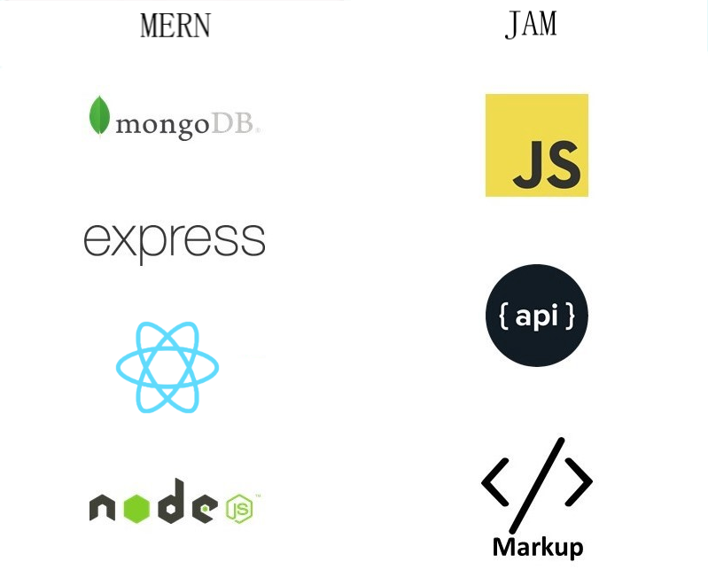

Developers are making tons of decision while developing the applications.
Selecting the web stack according to your application needs is one of critical decisions.

#### Web stacks are set of techniacal tools whcih can be an Operating System, a web server, database software, and a programming language.

Basically combination of different tools called a web stack and it allows developers to create web applications.
While some developers stick with traditional web stacks, some of them exploring the new ways to make future application efficent, fast and cost effective.

## JAMStack

#### JAMstack is fast

When it comes to minimizing the time of load, nothing beats pre-built files served over a CDN. JAMstack sites are super fast because the HTML is already generated during deploy time and just served via CDN without any interference or backend delays.

#### JAMstack is highly secured

Everything works via an API and hence there are no database or security breaches. With server-side processes abstracted into micro service APIs, surface areas for attacks are reduced and so your site becomes highly secured.

#### JAMstack is cheaper and easier to scale

JAMstack sites only contain just a few files with minimal sizes that can be served anywhere. Scaling is a matter of serving those files somewhere else or via CDNs.

### Cons

#### Not great with heavy, dynamic features

- One of the significant limitations of using JAMStack is that it does not deal well with more dynamic features like e-commerce purchasing and logging in. This is because these features require a database in order to manage the transactions.

#### Highly dependent on third-party systems

- Moreover, it being highly dependent on third-party systems means that if they shut down, then so does JAMStack.

## MERN Stack

The components of MEAN include MongoDB as the Database layer, Express.js as the server-side application framework, React as the client-side of the application, and Node.js as the server-side environment. The best part is that all of its components are open source and all have a Javascript base. Components like MongoDB, Express, and Node have all gained recent traction on their individually because they all provide very unique advantages to web development.

#### Developers can write both client and server-side code in JavaScript

MERN primarily develops web applications that are based on JavaScript due to which the developer can write code for each side, such as the server and the client-side as well.

#### Best for high-traffic and high-volume databases

MERN is a great option when dealing with large databases consisting of non-relational data.

### Cons

#### Not great with relational data

- Even though MEAN works very well while dealing with large databases with non-relational data, the same cannot be said about this web stack while dealing with relational data, which is a considerable limitation.

#### Newer Isn’t Better

- New frameworks generally have similar problems. Less community knowledge, more bugs, and more security issues. Although in many ways MEAN is very easy because it is nearly 100% Javascript/JSON. It also has a lot of nuances that some developers might not have solved yet.
